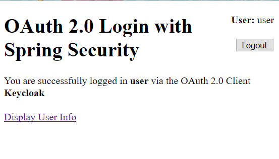
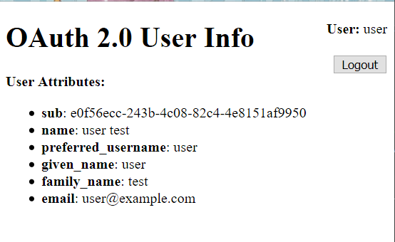

# keycloak-springsecurity5-sample

Spring Security 5 brought new OAuth2/OIDC client instead of the client support in the legacy Spring Security OAuth sub project. The new 
OAuth2 umbrella modules in the core project will replace the old Spring Security OAuth, Spring Social etc.  In the further 5.1, OAuth2 authorization server and resource server implementations are in plan, check the [OAuth2 related issues on Github ](https://github.com/spring-projects/spring-security/issues?q=is%3Aissue+is%3Aopen+label%3AOAuth2). 

Spring Security 5 OAuth2 client has built-in supports for facebook, github, okta, Google etc, unlike Spring Social, in the new version, Spring Security 5 provides a generic solution for client registration.

In the official Spring Security 5 source codes, there is a new [oauth2login sample](https://github.com/spring-projects/spring-security/tree/master/samples/boot/oauth2login) added to demonstrate the newest OAuth2 client.

In this post, we forked this sample, and try to bootstrap a local keycloak server as OAuth2/OIDC provider.

## Setup keycloak server

To simplify the work, I prepared a `docker-compose.yml` file to start keycloak server in a single command.

```yaml 
version: '3.3' 

services:    
     
  keycloak:
    image: jboss/keycloak
    ports:
      - "8000:8080"
    environment:
      - KEYCLOAK_LOGLEVEL=DEBUG
      - PROXY_ADDRESS_FORWARDING=true
      - KEYCLOAK_USER=keycloak 
      - KEYCLOAK_PASSWORD=keycloak
    depends_on:
      - mysql
      
  mysql:
    image: mysql
    environment:
      - MYSQL_ROOT_PASSWORD=root
      - MYSQL_DATABASE=keycloak
      - MYSQL_USER=keycloak
      - MYSQL_PASSWORD=password
    volumes:
      - ./data/mysql:/var/lib/mysql

```

Start up keycloak by `docker-compose` command.

```
docker-compose up
```

## Register client app in keycloak

When keycloak is started, open your browser and navigate to http://localhost:8000 or http://&lt;docker-machine ip&gt;:8000 if you are uisng a docker machine.

1. Create a new schema: **demo**.
2. Switch to the new **demo** schema in the dropdown menu.
3. Create a client app: **demoapp**.
4. Create a new user for test purpose.


## Configure keycloak in our application.

Create a new application via [Spring Initializr](http://start.spring.io) or fork the official [oauth2login sample](https://github.com/spring-projects/spring-security/tree/master/samples/boot/oauth2login).


Add a *keycloak* node under the *spring/security/oauth2/client* in the *application.yml* file.


```yaml
spring:
  security:
    oauth2:
      client:
        registration:
          keycloak:
            client-id: demoapp
            client-secret: demoapp
            clientName: Keycloak
            authorization-grant-type: authorization_code
            redirectUriTemplate: '{baseUrl}/login/oauth2/code/{registrationId}'
            scope:
              - openid
              - profile
              - email
        provider:
          keycloak:
            authorization-uri: http://localhost:8000/auth/realms/demo/protocol/openid-connect/auth
            token-uri: http://localhost:8000/auth/realms/demo/protocol/openid-connect/token
            user-info-uri: http://localhost:8000/auth/realms/demo/protocol/openid-connect/userinfo
            jwk-set-uri: http://localhost:8000/auth/realms/demo/protocol/openid-connect/certs
            user-name-attribute: preferred_username


```

For custom OAuth2 provider, you have to configure the details of the OAuth2 provider, and provides the details of client registration for OAuth client support.

Bootstrap the application, and navigate to http://localhost:8080 in your favorite browser.


You will find a **Keycloak** link in our application login page.

1. Click the keycloak link, it will guide you to redirect to keycloak login page.

    
	
2. Use the set user/password to login. 
3. if it is successful, it will return back to our application home page.

    

4. Click the **Display User info** link, it will show all userinfo from `/userinfo` endpiont exposed by keycloak.

    


Check out the [source codes](https://github.com/hantsy/keycloak-springsecurity5-sample) from my github account.	


    